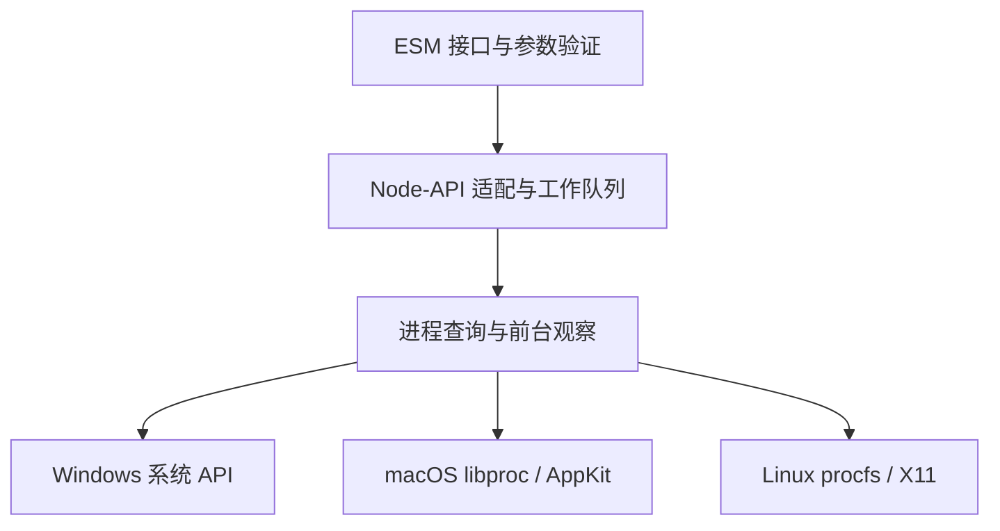

# 设计依据

## 目标与边界

本项目为 Node.js 提供进程信息与当前前台应用身份。二者同等重要：进程查询需要可靠、低成本地运行在桌面和服务器上，前台识别则需要准确表达当前桌面实际提供的能力。

核心要求是可理解的行为：名称与含义一致，单位明确，错误可区分，平台差异有依据，安装后的行为与开发时一致。系统信息不断变化，接口需要表达观察结果的边界，而不能让一个布尔值承担“否”“未知”“不支持”三种意思。

查询保持只读。持续监测、进程控制、窗口标题、CPU 采样、应用图标、浏览器标签和平台专属桌面插件都有各自的生命周期、权限和成本；它们不属于当前进程查询库的目标。调用者可以自行安排查询频率。

## 接口与数据

三个操作分别回答“有哪些进程”“这个 PID 的信息是什么”“谁在前台”。`listProcesses` 直接返回进程数组；`getProcess` 返回一条记录或 `null`；`getForeground` 返回 `ForegroundResult`，描述系统报告的前台归属。名称区分了完整进程记录与前台观察结果，不让使用者误以为前台查询已经取得进程详情。

进程查询和前台查询是平等、独立的能力。枚举进程无需连接桌面服务；前台查询无需遍历进程表。调用者可以显式组合两项操作，并自行决定其中一项失败时如何保留另一项结果。当前不额外引入组合快照接口，也不赋予独立观察共同的采集时间或原子性。前台 PID 可能因筛选、权限、命名空间或进程退出而不在列表中。

进程记录固定包含六个字段，无法读取的详情统一为 `null`。固定结构免去了按字段选择产生的类型组合，也让“没有请求该字段”和“字段不可读”不再混用。当前详情查询通常共用一个进程句柄或一次基本信息读取；如果未来实际测量证明某类字段成本显著，应再引入有明确边界的详情操作。

`memoryBytes` 明确表示驻留内存／工作集；`startedAt` 明确表示 Unix 毫秒时间戳。原始系统精度与跨进程共享内存并不因接口统一而消失。`name` 是进程名，因此可被系统截断；它不是产品名或窗口标题。

前台结果采用判别联合：`active` 携带 PID 与来源；`none` 表示平台接口报告当前没有前台对象，包括切换时的瞬时空缺；`unavailable` 表达可预期的能力不足或无法稳定确认归属。应用可以包含多个进程，前台归属只标识窗口／应用对应的进程。来源字段用于诊断，主要业务逻辑依据结果状态。

意外查询失败统一通过 `ProcessQueryError` 抛出，携带 `ERR_PROCESS_QUERY_FAILED`、逻辑操作名和原始原生错误 `cause`。同步与异步版本使用相同的错误语义。参数错误在原生调用之前作为 `TypeError`／`RangeError` 返回；原生错误不会被当作参数错误，也不会被压成缺乏诊断信息的能力状态。

Windows 和 X11 的前台归属通过多个系统查询取得。窗口消失或焦点改变属于正常竞争，最多观察三次；仍无法稳定确认时返回 `unavailable: changed-during-query`。系统调用失败与协议错误立即进入异常通道。X11 的多次观察共用连接和两秒协议截止时间，避免因重试持续延长等待。

默认接口异步执行，`Sync` 后缀明确标识阻塞操作。参数在 JavaScript 边界严格验证并复制，避免 N-API 将负数、小数或过大的 PID 截断为另一个进程。异步参数错误与运行错误都通过 Promise 拒绝返回，同步操作抛出错误。

## 实现结构

Rust 负责系统资源、查询和生命周期，Node-API 只负责转换数据和调度工作。Rust 核心可以不加载 Node.js 独立测试。每次请求持有自己的查询状态，避免全局缓存把旧进程、旧权限或旧桌面状态带入新的观察。

选择 Rust 与 Node-API 是因为这里需要直接访问系统能力、清楚管理句柄，并在多个 Node.js 版本间分发原生模块。选择 `AsyncTask` 使用 Node.js 已有的 libuv 工作池，不额外建立 Tokio 运行时。[NAPI-RS 的任务模型](https://napi.rs/docs/concepts/async-task)明确区分工作线程计算与 JavaScript 线程上的结果转换。

进程信息没有采用命令输出解析：它会引入命令可用性、区域设置、编码和子进程启动成本。也没有引入通用监控框架，因为本项目只需要一组小而明确的字段，并且必须保留“读取失败”与数值零的区别。

## 平台选择

Windows 使用 Tool Help 快照确定 PID、父 PID 与名称，随后每个进程共用一个最小查询权限句柄读取路径、工作集和创建时间。句柄由 RAII 释放。路径缓冲区按需增长到系统长路径范围，枚举结束与枚举失败分别处理。[Microsoft 的快照 API](https://learn.microsoft.com/en-us/windows/win32/api/tlhelp32/nf-tlhelp32-createtoolhelp32snapshot)是此实现的基础。

macOS 使用 libproc，按返回字节数确认结构完整，PID 列表缓冲区不足时扩容重试，使用基本信息与任务信息提供父 PID、启动时间和 RSS。前台身份来自 `NSWorkspace.frontmostApplication`，语义是接收按键的应用。查询内创建 workspace 与 autorelease pool，避免跨请求长期保留 AppKit 对象或操作调用者的事件循环。[Apple 的接口定义](https://developer.apple.com/documentation/appkit/nsworkspace/frontmostapplication)与 [libproc 声明](https://github.com/apple-oss-distributions/xnu/blob/main/libsyscall/wrappers/libproc/libproc.h)分别说明这两类能力。AppKit 的时间变化属性涉及主事件循环，因此焦点连续切换必须在真实 macOS 桌面验收，编译成功不足以证明该行为。

Linux 从 procfs 读取进程基本信息。解析器按 `/proc/PID/stat` 的括号结构提取名称，支持空格、换行、括号和非 UTF-8 字节。启动时间使用 `/proc/stat` 的启动秒数与实际 tick 频率，RSS 使用实际页大小；不假设固定 4096 字节页，也不在每条记录中用当前时间倒推启动时间。[proc_pid_stat 的定义](https://man7.org/linux/man-pages/man5/proc_pid_stat.5.html)规定了这些字段的单位与含义。

Linux 与 macOS 在读取附加详情后重新核对进程启动标识，降低 PID 复用导致不同进程数据拼接的风险。Windows 的附加详情使用同一个已打开句柄。所有平台都只承诺一次观察：记录之间没有事务一致性，PID 与父 PID 也不是持续有效的身份句柄。

X11 使用 Rust 协议实现读取 `_NET_ACTIVE_WINDOW` 和 `_NET_WM_PID`，验证属性类型、长度、窗口变化与客户端主机名。没有使用 Xlib 的进程全局错误处理器，也不需要链接系统 libX11。按照 [EWMH 规范](https://specifications.freedesktop.org/wm/latest-single/)，窗口的 PID 属于其客户端主机；如果主机无法确认，就不能把该 PID 连接到本机进程表。协议交互设置超时，连接阶段则遵从操作系统的网络行为。

Wayland 的通用客户端协议没有与本项目需求等价的全局前台 PID 查询。XWayland 只能表示部分窗口，桌面专属扩展也无法形成统一的部署要求。因此进程查询完整可用，前台能力返回明确的 `wayland` 原因。这是协议边界，不是用空实现伪装平台支持。[Wayland 协议](https://wayland.freedesktop.org/docs/html/apa.html)描述了客户端可获得的对象与事件。

## 分发与验证

目标矩阵是三大系统的 x64、ARM64，以及 Linux glibc、musl 的区别，共八种二进制。加载器、打包工具共享 `native/targets.js`，检查脚本验证其与构建配置一致。不支持的平台直接报错，二进制版本必须与主包完全相同。

发布采用按平台拆分的 optional dependency，避免一次安装下载所有系统的二进制。源码清单与发布清单分开生成，防止开发安装依赖尚未发布的版本。两个依赖锁文件纳入版本控制；版本、平台矩阵、类型声明与安装内容都有检查。

测试围绕外部行为：当前进程与真实子进程、退出后的查询、空筛选与重复 PID、非法参数、并发隔离、Worker 加载、异步工作池、实际 npm 安装、损坏或版本不符的二进制。边界测试验证六个调用统一保留错误原因且列表不调用前台查询；Linux 测试区分能力状态与真实原生错误。平台解析器另外覆盖特殊输入，X11 测试在隔离的 Xvfb 显示中验证归属与窗口消失。

发布与普通 CI 共用验证流程，锁定同一提交，原生包全部就绪后才发布主包。提交之前的本机验证、跨目标编译检查、CI 的原生执行和真实桌面体验分别记录，不把其中一种当作另一种的证明。

## 本地检查

使用 Husky 连接 Git 钩子，lint-staged 负责暂存文件筛选、参数传递和部分暂存的处理。两个工具的职责明确：`.husky/pre-commit` 调用 lint-staged，`.husky/pre-push` 执行 `pnpm verify`。格式检查命令从 `package.json` 读取，与 CI 共用定义；Rust 检查按 crate 执行，不将单个文件名附加到 Cargo 参数中。

选择这组工具是为了减少项目自己维护的文件处理代码。文件筛选、长参数列表和暂存区处理交给 lint-staged；项目只保留声明式配置和两个简短入口。检查使用只读模式。隔离仓库测试覆盖空格、Unicode、引号、美元符号，以及部分暂存文件检查成功或失败后均保留原有暂存区与工作区内容。

安装集中在项目的 `prepare` 脚本：本地存在 `.git` 元数据时才安装，跳过 CI、生产依赖安装、显式禁用、源码归档和嵌套副本；保留其他自定义 `core.hooksPath`，允许刷新本项目的 `.husky/_`。只跟踪钩子入口，生成的启动文件留在忽略目录。发布清单移除开发脚本与依赖，消费者只安装运行所需的原生包。

安装与卸载成对提供。安装记录 Husky 生成文件的名称和内容哈希；卸载只撤销本项目写入的本地配置值，并逐个删除内容未变的已记录文件。未知文件、手动修改、其他工具的设置、全局配置和配置包含文件都予以保留。路径检查拒绝符号链接或越出工作目录的生成目录，不通过递归删除清空用户目录。

Git 的本地配置可能由多个 worktree 共用，因此清理共享配置前检查其他注册工作目录是否仍有 Husky 启动文件；只有最后一个安装被移除时才撤销共用设置。未启用的源码钩子入口保留在版本管理中，使重新安装保持明确、可重复。

卸载本身不依赖 Husky 包，依赖移除之后也可以执行。当前 pnpm 的 `remove` 不调用 `prepare`，所以完整移除应先执行 `pnpm hooks:uninstall`，再删除依赖与项目入口。如果之后的 `prepare` 发现 Husky 已不在依赖声明中，会转为清理，避免缺失模块错误；跳过生命周期脚本时仍需显式卸载。

开发与 CI 构建使用 Node.js 24，以满足 lint-staged 17 的要求；库的运行时最低版本仍为 Node.js 22.13。本地钩子提供及时反馈，CI 验证提交版本并覆盖完整平台矩阵。
